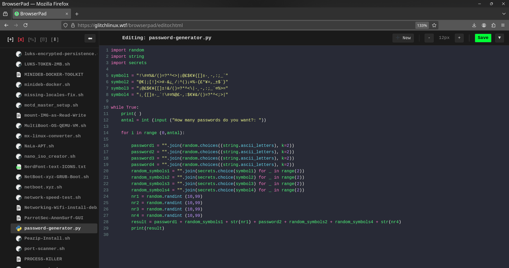
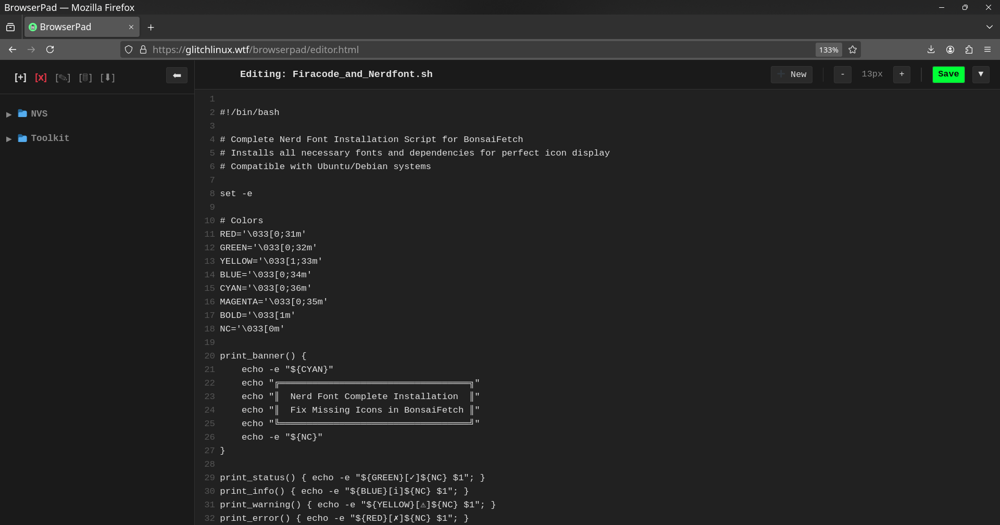

# BrowserPad v2

> A fully self-hosted web-based code editor


## Screenshots

### Dracula Theme (Python)


### Material Darker Theme (Shell)


## Features

### Editor
- **Syntax Highlighting** - JavaScript, Python, Shell, CSS, HTML, Markdown, C/C++, and more
- **Dark Themes** - Material Darker (default) and Dracula
- **Line Numbers** - Toggleable
- **Adjustable Font Size** - Increase/decrease on the fly

### File Management
- **Folder Tree** - Expandable/collapsible directory navigation
- **File Icons** - Visual file type recognition
- **Create** - New files and folders `[+]`
- **Rename** - Files and folders `[✎]`
- **Delete** - With trash system `[x]`
- **Download** - Direct file download `[⬇]`
- **Binary File Support** - Select/delete PDFs, images, etc. without errors

### Trash System
- **Soft Delete** - Files move to `.trash/` instead of permanent deletion
- **Restore** - Recover deleted files
- **Timestamps** - See when files were deleted
- **Empty Trash** - Permanent cleanup when ready

### UI/UX
- **Custom Modal System** - Unified dark-themed dialogs (no browser popups)
- **Keyboard Support** - Enter to confirm, Escape to cancel
- **Responsive** - Collapsible sidebar

### Security
- **HTTP Basic Auth** - Password protected access
- **Path Traversal Protection** - Sandboxed to `/files/` directory
- **No Shell Execution** - Pure PHP file operations

### Self-Hosted
- **Zero External Dependencies** - CodeMirror bundled locally
- **No CDN Calls** - Works offline/airgapped
- **No Database** - File-based storage
- **Single Directory Deployment** - Just copy and configure

## Installation

1. Copy the `browserpad/` directory to your web server
2. Ensure PHP 7.4+ is available
3. Set permissions:
   ```bash
   chmod 755 browserpad/
   chmod 777 browserpad/files/
   chmod 777 browserpad/files/.trash/
   ```
4. Update `.htpasswd` with your credentials:
   ```bash
   htpasswd -c browserpad/.htpasswd yourusername
   ```

## Directory Structure

```
browserpad/
├── api/
│   ├── codemirror/     # Editor engine (MIT licensed)
│   │   ├── codemirror.min.css
│   │   ├── codemirror.min.js
│   │   ├── theme/
│   │   ├── mode/
│   │   └── LICENSE
│   └── files.php       # File operations API
├── files/              # Your files (sandboxed)
│   └── .trash/         # Deleted files
├── icons/              # File type icons
├── screenshots/        # README images
├── editor.html         # Main application
├── script.js           # Application logic
├── style.css           # Styling
├── .htaccess           # Auth configuration
└── .htpasswd           # User credentials
```

## API Endpoints

| Action | Method | Description |
|--------|--------|-------------|
| `list` | GET | List directory contents |
| `read` | GET | Read file content |
| `write` | POST | Save file |
| `create` | POST | Create new file |
| `delete` | POST | Move to trash (or permanent) |
| `mkdir` | POST | Create directory |
| `rename` | POST | Rename file/folder |
| `trash_list` | GET | List trash contents |
| `restore` | POST | Restore from trash |
| `empty_trash` | POST | Permanently delete trash |

## Tech Stack

- **Frontend** - Vanilla JavaScript (ES6+)
- **Editor** - CodeMirror 5.65.15
- **Backend** - PHP 7.4+
- **Styling** - CSS3 with CSS Variables

## License

- **BrowserPad** - MIT License
- **CodeMirror** - MIT License

## Credits

- [CodeMirror](https://codemirror.net/) by Marijn Haverbeke
- Built with Claude (Anthropic)
